# Comparison of Latent Space Distributions in a Variational Auto-Encoder using Cat Dataset

## Variational Autoencoders
A standard autoeoncoder compresses the observation X into a smaller dimensional latent space Z using an encoder φ(x) and then decompresses it using decoder θ(z). It's useful for data compression but we can't use it generate synthetic data by sampling random z and running that through the decoder, as the the model pust no real constraints on the distribution so similar observations can be placed far apart in the latent space and vice versa. Thus, the autoencoder is extended to being probabilistic, not deterministically mapping X -> Z and back Z -> X but mapping to a random distribution Z ~ p(Z|X) and X ~ p(X|Z). It is assumed the data X comes from some true distribution X ~ p(x) and we pick an arbitrary distribution that is easy to work with that the latent space exists in, where can easily sample from. Now the challenge is to build the encoder-decoder model such that θ(X) provides the parameters for the distribution that Z is sampled from and φ(Z) provides the parameters for the latent representation to be sampled from and θ(Z) that provides the parameters for the reconstruction to be sampled from. 

Given the data comes from some true distribution p*(x), we approximate this with p(x) with the help of the latent variable by modeling the joint distribution p(x,z). But marginilizing this to get just p(x) is intractable, so this means calculating p(z|x) is also intractable, so we approximate this through a [variational distribution](https://en.wikipedia.org/wiki/Variational_Bayesian_methods) q(z|x) of our choice. We optimize this approximation by maximizing the [Evidence Lower Bound](https://en.wikipedia.org/wiki/Evidence_lower_bound) (ELBO). In this project, I am comparing a standard normal, exponential, and laplacian distributions as the variational latent distriubtion.

# Files
- `cats.py` has utilities for loading the cat dataset and saving batches of images
- `vae.py` has implementation of a Normal, Exponential, and Laplacian latent spaces, code to train them, and to generate the images below

## Images
Given a [dataset of about 30k images of cats](https://www.kaggle.com/datasets/borhanitrash/cat-dataset)

### Some images from the dataset
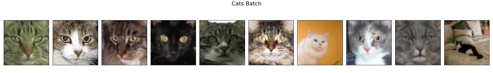

### Samples taken with normal latent space
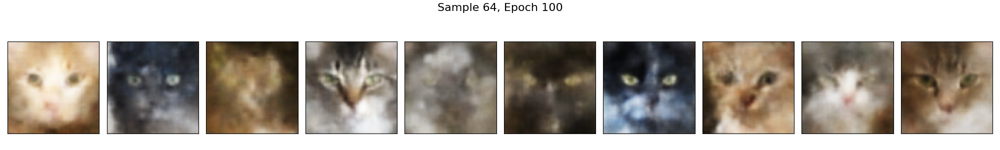

### Samples taken with exponential latent space
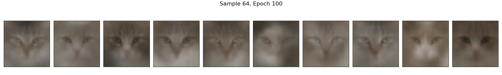

### Samples taken with laplacian latent space
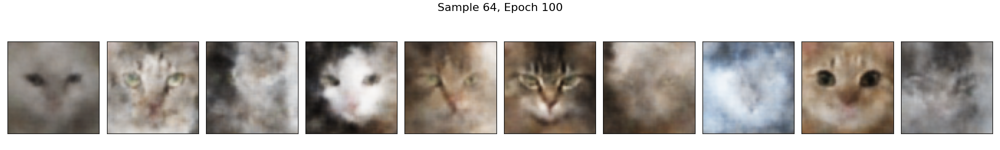

### Reconstructions

#### Original images
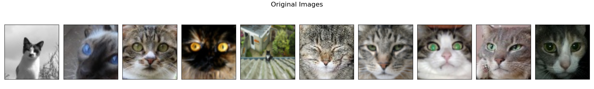

#### Reconstructions using normal latent space
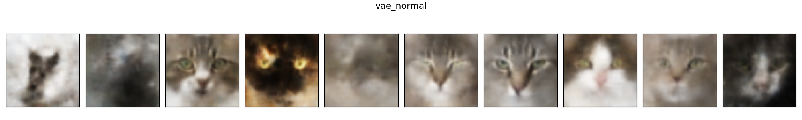

#### Reconstructions using exponential latent space
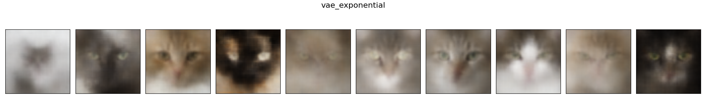

#### Reconstructions using laplacian latent space
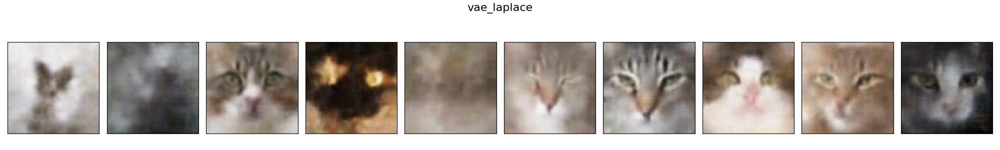

### Model means ("most average cats")
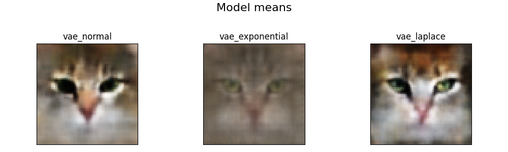

### Latent space interpolations

#### Original interpolation
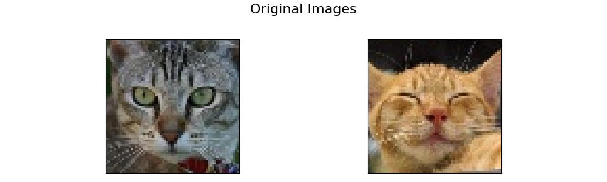

#### Interpolation with normal latent space
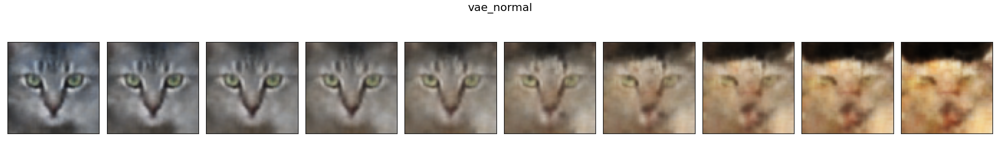

#### Interpolation with exponential latent space
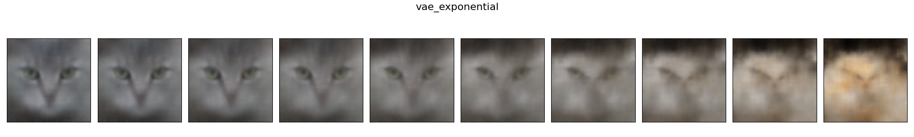

#### Interpolation with laplacian latent space
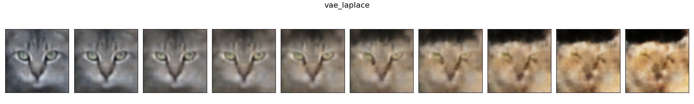
